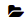
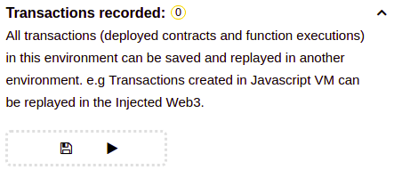

Files provided: attacker.sol, dao.sol

The goal of this challenge is to understand how the infamous Decentralized Autonomous Organization (DAO) hack of Aprl 2016 happened. 

In this assignment you will play two roles: 

1. The attacker 

- As an attacker, you will attempt to exploit a vulnerability in the a Bank's smart contract and steal some money. 

You are provided with attacker.sol. There are rumours on the dark web that bank.sol is vulnerable to what is known as the reentrancy attack. This means that when a user calls a method of the smart contract, some path of steps might lead to the contract calling another method of the user's contract, leading to a loop of sorts. 
As an attacker, you must try to use this to transfer all of the ether (money) from the bank into your contract.

Lets get started with the setup.
- Open the Remix web IDE (https://remix.ethereum.org/) on your browser. Remix is very useful while coding and testing out smart contracts on the blockchain.
- This handout will guide you through remix using the previous version. Feel free to the the latest version if you;re more comfortable. 

- Click on the Load files icon  and load your attacker.sol, bank.sol and setup.json files.

- Open the setup.json file in the editor, and click on the run Tranactions button in the Transactions tab on the right panel.

- The scenario is now set. In the deployed contracts tab on the bottom right, you can see and interact with the bank's smart  contract. This is the deployed version of the code in bank.sol.
- Try selecting an account from the dropdown menu on the top right corner of the page and interact with the contract. For each button on the contract, take a look at the code in bank.sol to understand what's actually happening.
- Now open the attacker.sol file in the editor. You goal is to add some code in attacker.sol, deploy the attacker contract, and use the deployed version of the contract to steal all of the bank's ether.

Note: When deploying your contract, make sure to give your contract some ether. No bank will want to do business with a person with no money !! ()

Note: You should set the remix compiler to match your solidity version. (For example if your code says `pragma solidity 0.4.26;`, the compiler should `0.4.26+commit.XXXXXX`. Find this setting in the Compile tab.)

Hint: Also look at the logs in the transactions being recorded on the blockchain.

2. The Bank Developer

- As a Security Engineer for the Bank, you will find this vulnerability that an attacker might exploit and fix it. (This might save you a lot of money someday)

After most recent hack, your boss is really mad at you. You must find the vulnerability that the attacker exploited and fix it immediately, lest more attackers figure it out and steal even more ether. You are provided with bank.sol. Find and fix the vulnerability that caused the reentrancy attack. 

Lets get started.
- If you were successful in performing the reentrancy attack in part 1, you already know where the vulnerability is.Your goal is to fix the vulnerability.
- Modify the code in bank.sol. Deploy the bank with some ether. And try your attack again. Did it work ? If yes, your bank is still vulnerable. If not, GOOD JOB !! You fixed the vulnerability. Expect a big promotion soon :) 

For more info, you might want to read up on these articles.

The DAO Hack Explained: Unfortunate Take-off of Smart Contracts
https://medium.com/@ogucluturk/the-dao-hack-explained-unfortunate-take-off-of-smart-contracts-2bd8c8db3562

Explaining the DAO exploit for beginners in Solidity
https://medium.com/@MyPaoG/explaining-the-dao-exploit-for-beginners-in-solidity-80ee84f0d470
