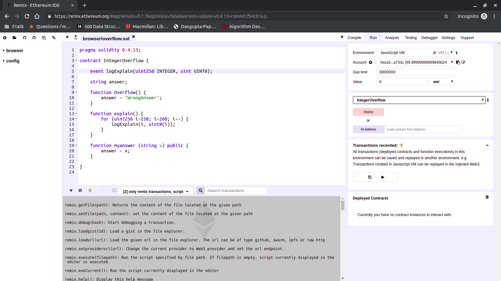

Files provided: attacker.sol, dao.sol

The goal of this challenge is to understand how to use thr Remix IDE and deploy simple smart contracts.

0. Getting to know the system.

Lets get started with the setup.
- Open the Remix web IDE (https://remix.ethereum.org/) on your browser. Remix is very useful while coding and testing out smart contracts on the blockchain.
- This handout will guide you through remix using the previous version. Feel free to the the latest version if you're more comfortable. 

- Click on the Load files icon  and load your starter.sol file, and open it in the editor.

- Your screen should look similar to this.

- On the top right corner, you'll see the accounts tab. Remix by default gives you 5 test accounts with 100 ether each. always make sure your environemnt is set to JavaScript VM.

- Below that you'll see the deployment tab, This is where you'll deploy contracts you code in the editor.

- At the bottom right, you'll see the deployed contracts. Here you'll be able to interact with the contracts just as a user would. 

- At the bottom of the screen, you'll see the transactions tab. This will show you all the information about the transaction as seen publicly on the blockchain. 

- One last important tab is the compilation tab. When compiling your code, you should set the remix compiler to match your solidity version. (For example if your code says `pragma solidity 0.4.26;`, the compiler should `0.4.26+commit.XXXXXX`. 

Now that you know the main aspects of remix, lets deploy some contracts.

1. Integer overflow 

Numbers on a computer are stored the in the same way the (old timey) gauges at gas stations calculated the price you had to pay. This means at some point the value could be longer than the number of digits the gauge can hold, and the gauve would reset at 0.

 

The code in front of you represents a very simple smart contract that demonstrates the same idea. 
The function `explain` runs a loop where that prints `i` (an unsigned 256 bit integer) and `uint8(i)` (the same 256 bit integer put into an 8 bit integer space).
It is trivial to understand that at some point a 256 bit int will not fit in the space allocated for an 8 bit int.

Click deploy in the deployment tab. You will notice a new item in the Deployed contracts tab. You will be able to execute the contracts functions from here.

Try executing the explain function and look for the log statement of line 15 in the transaction tab.
Try to find the exact point where the integer overflows out fo the 8 bit integer space.

Once you have found it, Execute the `myanswer` function with the the input parameter as the last value of stored in the `uint8` before it resets to 0.

If you see `"string x": "YourAnswer"` in the latest transaction in the transaction tab, you followed these steps correctly.

2. Submitting your code. 

Under the transactions recorded tab, click save. This will create a .json file with a snapshot of blockchain. Copy this entire file and save it as `answer.json`.

Submit answer.json on seclab. 