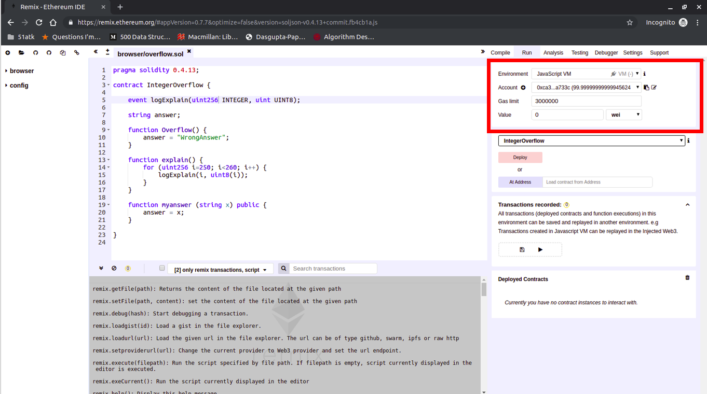
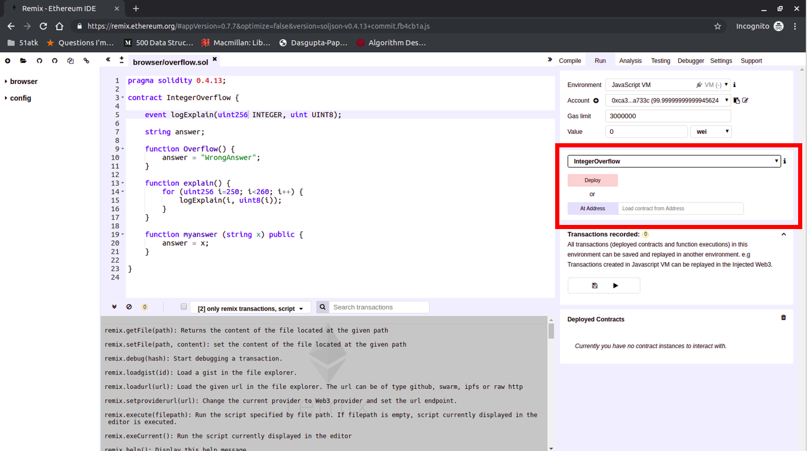
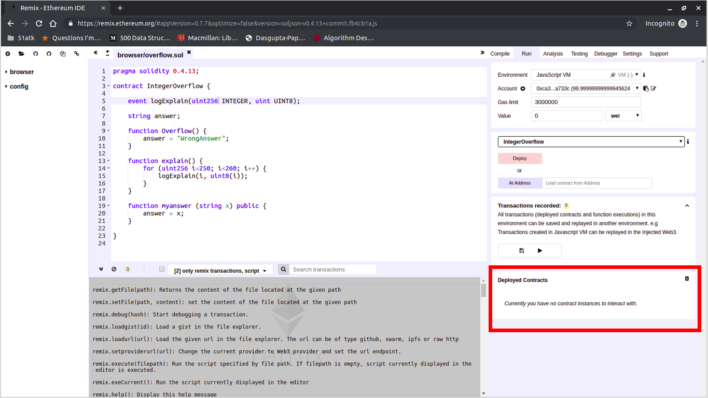
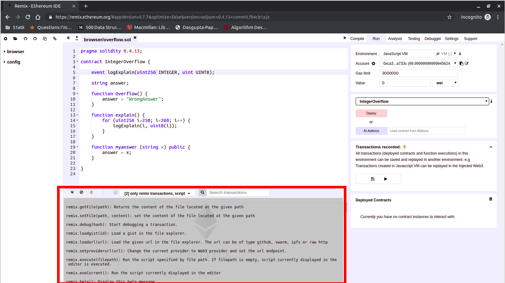
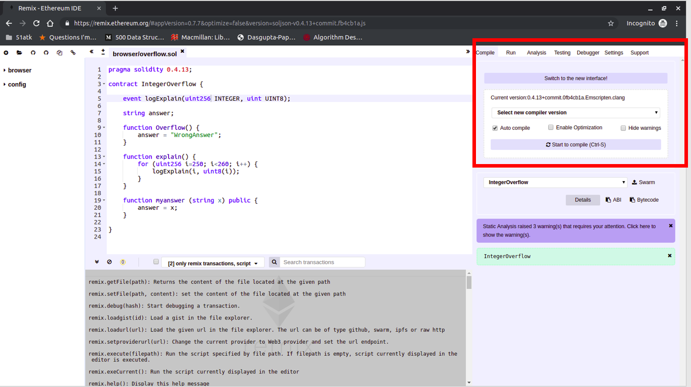

Files provided: attacker.sol, dao.sol

The goal of this challenge is to understand how to use thr Remix IDE and deploy simple smart contracts.

0. Getting to know the system.

Lets get started with the setup.
- Open the Remix web IDE (https://remix.ethereum.org/) on your browser. Remix is very useful while coding and testing out smart contracts on the blockchain.
- This handout will guide you through remix using the previous version. Feel free to the the latest version if you're more comfortable. 

- Click on the Load files icon  and load your starter.sol file, and open it in the editor.

- Your screen should look similar to this.

- On the top right corner, you'll see the accounts tab. Remix by default gives you 5 test accounts with 100 ether each. always make sure your environemnt is set to JavaScript VM.

- Below that you'll see the deployment tab, This is where you'll deploy contracts you code in the editor.

- At the bottom right, you'll see the deployed contracts. Here you'll be able to interact with the contracts just as a user would. 

- At the bottom of the screen, you'll see the transactions tab. This will show you all the information about the transaction as seen publicly on the blockchain. 

- One last important tab is the compilation tab. When compiling your code, you should set the remix compiler to match your solidity version. (For example if your code says `pragma solidity 0.4.26;`, the compiler should `0.4.26+commit.XXXXXX`. 

Now that you know the main aspects of remix, lets deploy some contracts.

1. Integer overflow 

Numbers on a computer are stored the in the same way the (old timey) gauges at gas stations calculated the price you had to pay. This means at some point the value could be longer than the number of digits the gauge can hold, and the gauve would reset at 0.

 

2. The code

MovieBank is a new startup that helps movie theatres keep track of their ticket sales by storing the info on the blockchain. But they have received a lot of backlash for not implementing adequate security and being reckless in their development process. You read on a hacker blog that their TotalEarnings Contract might be have an interger overflow vulnerability. Being a curious CS student, you decide to take a look at the code.

Part 1 - The attacker

Your goal here is to try to perform an integer overflow attack on the contract to see if its really possible.

The code in front of you is the TotalEarnings Contract.

Click deploy in the deployment tab. You will notice a new item in the Deployed contracts tab. You will be able to execute the contracts functions from here.

- Try calling `AddRevenue` with with 50 as input parameter in the deployed contract. 
- Now Try calling the `getRevenue` function and look at the transactions in the transactions tab and verify the return value.
-See if you can find the exact point where the integer overflows. This means that if you can force the number to increase enough, you can make MovieBanks earnings 0. 

Once you have found the largest earning value that can be stored, Execute the `myanswer` function with the the input parameter as your answer. 

This means that if the revenue is 10, and you call addRevenue(1), and the renevue becomes 0. Then your answer is 10. 

Part 2 - The fix

Being a responsible Computer Security Student, you decide to find a fix to this and report it to MovieBank. Modify the code to fix the integer overflow bug. You can do this by either (1) Capping the reveue at the max value so that the overflow doesn't occur. or (2) changing the integer type to accomodate a larger numberspace.
You need to implement one or both of these options.

2. Submitting your code. 

Under the transactions recorded tab, click save. This will create a .json file with a snapshot of blockchain. Copy this entire file and save it as `answer.json`.

Submit answer.json and the edited starter.sol on seclab. 
